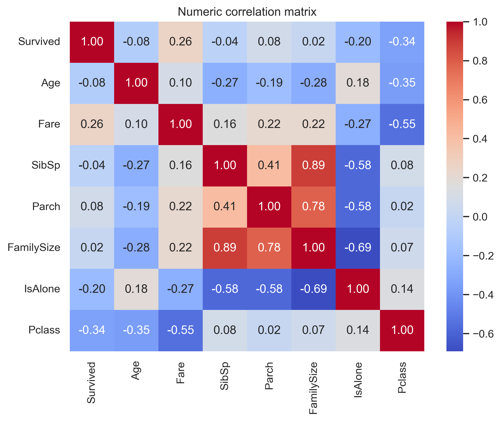
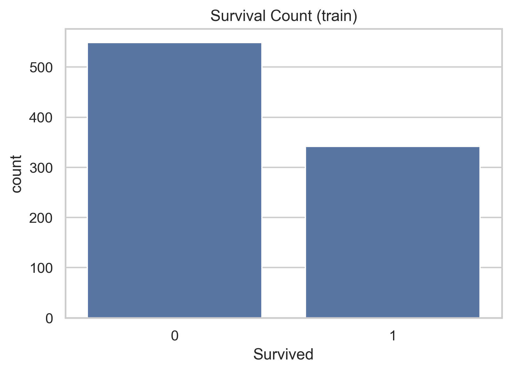

# 🛳 Titanic EDA

## 📌 Overview  
This project performs **Exploratory Data Analysis (EDA)** on the famous **Titanic dataset** to uncover patterns, trends, and relationships influencing passenger survival.  
Using Python, we clean and analyze the data, generate insightful visualizations, and summarize findings in a detailed PDF report.

---

## 📂 Repository Structure  

```plaintext
titanic-eda/
│
├── data/
│   ├── train.csv
│   ├── test.csv
│   ├── gender_submission.csv
│
├── notebooks/
│   └── titanic_eda.ipynb
│
├── images/
│   ├── Age_distribution.png
│   ├── Survival_Count.png
│   ├── Pclass_VS_Survival.png
│   ├── Fare_distribution.png
│   ├── Fare_by_Pclass_and_Survival.png
│   ├── numeric_correlation_heatmap.png
│
├── reports/
│   └── titanic_eda_report.pdf
│
├── README.md
├── requirements.txt
└── .gitignore

---

# 🛠 Tools & Libraries
Python

Pandas – data manipulation

Matplotlib & Seaborn – visualizations

NumPy – numerical operations

Jupyter Notebook – analysis environment

---

## 📊 Analysis Steps
1️⃣ Data Loading & Overview
Checked data structure using .info(), .describe(), .head()

2️⃣ Data Cleaning
Filled missing values (Age, Embarked, Fare)

Created new features: FamilySize, IsAlone

3️⃣ Exploratory Data Analysis
Survival distribution by Sex, Pclass, Age, Fare

Relationship between features (heatmap)

4️⃣ Visualization
Histograms

Boxplots

Bar charts

Heatmaps

5️⃣ Summary of Findings
Higher survival for females and first-class passengers

Children had better survival chances

Higher fares correlated with survival

Traveling alone lowered survival rate

---
## 📈 Example Visualizations
  

---

📄 Report
A detailed PDF report summarizing the findings can be found here:
reports/titanic_eda_report.pdf

---

🚀 How to Run
1. Clone the repository
bash
Copy
Edit
git clone https://github.com/yourusername/titanic-eda.git
cd titanic-eda

2. Install dependencies
bash
Copy
Edit
pip install -r requirements.txt

3. Open Jupyter Notebook
bash
Copy
Edit
jupyter notebook notebooks/titanic_eda.ipynb

📬 Author
Rina Kumari
📧 rinavadera2003@gmail.com
🔗 https://www.linkedin.com/in/rina-508462249/

